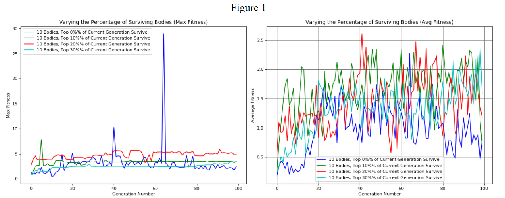
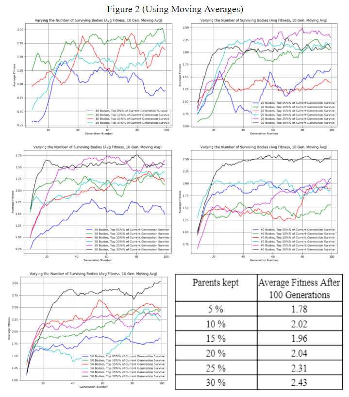
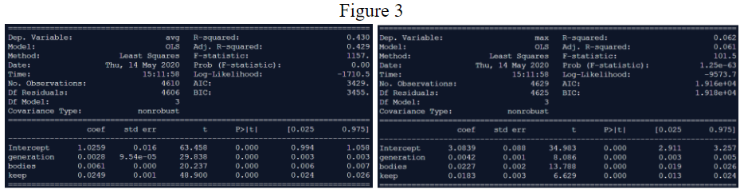

# The Strasburg Machine
### By [Matthew Graber](https://github.com/grabermtw), [Matthew Vorsteg](https://github.com/mvorsteg), [Jordan Woo](https://github.com/minersail), [Timothy Henderson](https://github.com/timhenderson17), and [Zhiyuan (Ben) Xue](https://github.com/zxue02)

## Abstract
In this project, we experiment with training an agent to throw a ball in a 3D environment. We use evolutionary strategies to pass down traits, such as torque applied to specific joints of an arm and release time, between generations. Our project aims to create an evolutionary strategy such that agents learn to throw a ball. We are chiefly concerned with the effect of allowing the fittest agents from a current generation into the population for a subsequent generation. In our experiment, we measure the maximum and average fitness of a generation while varying the percentages of fit individuals that persist across generations unchanged. Our results show that our approach is effective at forcing the agent to learn quickly, and agents learn faster and show the most improvement when 30% of the fittest individuals survive to the next generation. Our results lay the framework for genetically engineered agents in video games where complex locomotions are required. 
## Introduction
In this project, we set out to investigate the possibility of training human-like, 3D characters in the Unity game engine to throw a ball. It is common to use machine learning methods to teach agents how to move and behave in both 2D and 3D game engines. In the past, we have seen demonstrations of evolution strategies and genetic algorithms being used for this purpose, training agents to navigate obstacle courses and other environments. For this project, we sought to train the agents to perform a realistic task (in this case, throwing a ball) as efficiently as possible, laying the foundations for the eventual creation of realistic auto-generated animations for 3D characters in video games where complex and unusual behaviors are necessary.

Past and current uses of evolutionary computation in this area has focused on using genetic algorithms for locomotion, in particular bipedal and quadrupedal locomotion of robots. Locomotion is commonly studied using genetic algorithms because it originally came about from natural selection but, perhaps more importantly, also because of the relatively straightforward fitness function. A recent research by Jakub Hulas and Chengxu Zhou (2020) used a genetic algorithm to improve the gait of a quadruped robot on sand. Walking on sand is difficult for robots because the feet penetrate the sand while walking. A 2D gait was given to the algorithm initially and the algorithm generated 3D gaits. The algorithm ultimately generated an effective gait, optimising the joint space trajectory. This research demonstrates the power of genetic algorithms even in special circumstances, in this case locomotion on sand. 

While locomotion was the focus, there have been studies and research on effectively moving arms using genetic algorithms. This task is considered more difficult because an arm can perform more functions, has more freedom, and requires more precision than a leg. Certain arm functions, such as pick-and-place, even require extreme precision. Ligutan et al. (2019) used genetic algorithms to carry out motion planning for a robotic arm with 4-DOF. It did so by changing a variable-length genome of joint angles. The developed genetic algorithm, with an adaptive linear interpolation crossover to improve convergence, effectively generated paths to its target while being able to avoid obstacles. However, on average the error was 1.4 mm. So, even though the arm was not complicated (only 4-DOF), it still cannot handle tasks that would require extreme precision.

Previous works have highlighted the effectiveness of genetic algorithms in generating solutions in complicated scenarios, particularly relating to locomotion. However, genetic algorithms still fall short when applied to other body parts, particularly the arm. In this research study, we seek to explore this weakness. Throwing a ball normally does not require extreme precision but throwing a ball as far as possible does (e.g. when to release and the torques of the joints). Thus, in this way, we can explore how far evolutionary computation can take us in respect to the precision of an arm.

In addition to simply training the agents to throw the ball, we sought to determine the best method for using an evolution strategy to train the agents for this task (i.e. number of agents, percentage of parents to keep, crossover probability, mutation probability, etc.). We hypothesized that for each training session, a sharp increase in fitness (the distance the ball is thrown in the direction the agent is facing) would be observed initially, followed by an asymptotic leveling as the generations increase. In order to achieve this, we set out to accomplish the following objectives:

1. Setting up the environment and the 3D agents within the Unity game engine.
2. Designing and implementing an evolutionary learning method that gives usable parameters to the agents.
3. Accounting for nondeterministic physics within the Unity game engine.
4. Implementing a way to export the data from the program in a usable format for further analysis.
5. Building out the project so that the simulation can easily be run with different parameters to obtain data.

In the rest of this report, we will discuss the methods we followed to obtain these above objectives, including the different parameters involved in the evolutionary learning algorithm chosen. Following this, we will discuss the methods that we used to collect data from our algorithm and the results obtained from testing. Lastly, we will analyze key results and discuss the significance of our findings with respect to our original goals, objectives, and hypothesis.
## Methods
In order to approach this project, we started by creating a template for an agent in a simple 3D environment. This agent has moveable joints in its right shoulder, arm, elbow, and wrist. The agent is also holding a ball that it will release from its grip after a set amount of time. Unity provides the environment with a realistic physics engine, so that gravity is applied to the ball and the agent’s arm. Thus, the agent is capable of throwing the ball, but does not know how to move its arm to accomplish this. Our goal with this is to implement an evolutionary learning method in which agents learn, over numerous generations, how to throw a ball.

In deciding which evolutionary learning technique was best, we looked at both standard genetic algorithms and evolution strategies. Because of the nature of the task we set out to accomplish and the environment (Unity) that we would be using to implement our evolutionary computation, we decided it was best to use an evolution strategy. Our agents’ chromosomes are real-valued vectors containing the information needed to perform a single throw. For the four joints, we control the torque applied in the x, y, and z direction to the joint at the start of the throw. For the last value in the vector, we control the release frame of the ball. More colloquially, this value will control how long the agent holds onto the ball before releasing it. Given these parameter values, an agent will be able to make an attempt to throw the ball. Keeping these values in a vector is better suited for this application, as there is no easy way to convert all values in the vector into a binary string and still easily be able to recognize the genes present in each chromosome. Keeping the values separate in a vector is more readable and easier to distinguish between genes.

We implemented our evolutionary strategy as a C# script in Unity to oversee the progression of our population. We first define our fitness function as the distance the ball traveled in the z-direction before hitting the ground. Given that we wanted the agents to throw as far as possible, keeping track of the total distance a ball travels didn’t make sense, so individuals were allowed to learn many different throwing techniques. Keeping track of the distance in one direction also prevented individuals that throw sideways from being fitter than those throwing straight. In determining an agent’s fitness, we also make them throw a certain number of throws. This is necessary to account for “flukes” in the data when an agent makes an inconsistent throw. Unity’s physics engine is non-deterministic, so seemingly unrealistic data may be generated from glitches. The median value of the agent’s throws is taken as its final fitness score, which makes it resistant to outliers, both high and low.

When choosing individuals to crossover for the next generation, we used a fitness-proportionate selection so that fitter individuals have the best chance to pass on their traits and weaker individuals will have a small chance. We select our individuals using a roulette wheel style selection where the chance of being selected is directly proportional to an individual's fitness. After choosing the individuals, we determine if crossover using a set crossover probability, pc. We decided between three options for the method by which we perform crossover. The first option was to use single point crossover. Doing this would mean simply choosing a position in the two individual’s vector’s and crossing over beyond that part. We decided that there was no logical way to determine where that crossover point should be. Another option we had to consider was whole-arithmetic recombination. This method treats the two chosen individuals as parents, and creates a child whose weights are the average of the parents’ values. We believed that this method would make the children less fit because the torque values and release point are quite sensitive. The crossover method we chose was a uniform crossover. With this method, each joint of a child created by the parents had an equal chance of being the torque value from parent one and parent two. This follows the Building Block Hypothesis, as the torques applied to each joint release point create a unique chromosome for an individual agent, and each variable (building block) can be combined during crossover and reproduction to create more fit individuals.

After crossover, there is a small probability, pm, that an individual will be mutated before it moves on to the next generation. Our mutation is performed by generating a new, random value for the x, y, and z torque values for a particular joint. With a small chance of mutation, our population should maintain genetic diversity from one generation to the next.

This algorithm successfully allows for agents to learn to throw, but we can also experiment with the fastest ways our agent can learn, as there are a number of hyperparameters that we can manually adjust before learning. We can alter pc and pm as well as the number of agents in each generation and the percent of parents carried over from one generation to the next. These standard parameters are modified before learning. 

Lastly, in order to make sure that fitter individuals would have an impact on the next generation, we allow for a certain percentage of the agents in a generation to automatically be used in the next generation. Including a small percentage of the fittest individuals is a common technique in many genetic and evolutionary algorithms. In our experiment, we measured the maximum and average fitness per generation while modifying the percentage of fittest individuals allowed into the next generation and keeping all other parameters fixed. Due to the many different parameters for the model itself, we decided to look into the specific effect of changing this one parameter and seeing how effective the evolutionary strategy works.

Trials were run using the algorithm mentioned above in Unity. Each trial consisted of measuring and recording the max fitness and average fitness of each generation for 100 generations. Percentage of fittest individuals kept and number of agents in each generation varied between trials.

## Results

The above three figures demonstrate our results for testing. As mentioned in the Methods section, we sought to determine (1) the effectiveness and viability of our evolutionary strategy and (2) the effect of allowing various percentages of agents to “survive” from one generation to the next. Figure 1 depicts both the maximum throwing distance for a generation as well as the average distance thrown between all of the agents in a generation. For the trials in figure 1, we have 10 agents. A key observation in the graph on the right of figure 1 is that there is a lot of noise with respect to the population’s progress from generation to generation, and it is hard to decipher how each of the training runs performed. To combat this, the plots for the rest of the data, in figure 2, are all moving average plots with a sliding window of ten generations. This line smooths the data for us and allows for clearer interpretation.

Taking a look at the graphs in figure 2 we can see some immediate, qualitative results. In general, keeping the fittest 30% of individuals from the current generation to move to the next generation leads to a higher average fitness in the long run.There is also a very clear trend that can be observed given the graphs in figure 2. All graphs tend to converge rather quickly to an optimal solution. As we have observed with other genetic algorithms, they tend to find a solution that works in early generations and then make little to no progress in generations beyond that. The plots of the maximums for each trial run also converged quickly (after about 20 generations) and had little variation beyond that point relative to the plots of the average distances.

For quantitative analysis of the dataset as a whole, we looked to use regression to try and determine the impact of different parameters with respect to each other. Consider a data point to be a single generation - this data point contains the maximum fitness, average fitness, and generation number, as well as data on the number of bodies and percent parents kept for the trial that contained that generation. This meant we could run two regressions, one predicting maximum fitness and one predicting average fitness, using generation number, body count, and parent percentage as predictors. Using the trials we had conducted so far, we had a sample size of around ~3400 data points.

Figure 3 shows the results when predicting both average and maximum fitness. On the left, coefficients and p-values can be seen for the regression predicting average fitness. The p-value for the F-statistic is 0, indicating that the fit as a whole is statistically significant. The p-values for each of the predictors is also 0, indicating that generation number, body count, and parent percentage were all significant in predicting average fitness. The R-squared value is low, at around 43%, indicating that there is a significant amount of unexplained variance in our dataset. On the right, coefficients and p-values can be seen for the regression predicting maximum fitness. While the p-values for both the F statistic and each individual t-statistic are all also 0, indicating that they are significant, the R-squared value is very low (<1%).

## Discussion
After viewing our results, it is apparent that the evolutionary strategy we set out to create is effective in training the agents to throw the ball in the correct direction. Looking at the plots, we can see from the steep initial rises in the fitness that the agents tend to rapidly learn how to throw the ball in the correct direction. Following the steep initial rises, the fitness tends to still gradually increase while leveling off in later generations, despite irregular spikes and valleys in the fitness. We found that keeping the top 30% of the population between generations yielded a fitness consistently higher than keeping lower percentages of the generation alive.

We also found significant limitations within our research. First and foremost, we found that the Unity game engine has non-deterministic physics. While the physics engine was accurate enough to have a good combination of torques produce a proportionally good throw, the exact distance was not the same for throws with identical parameters. This made it very difficult to measure fitness between 2 similar individuals, as any individual could throw the ball extremely far or extremely short on a “fluke”. Although we were able to somewhat remedy this by taking the median of multiple throws every generation, this led to significant spikes in the maximum fitness graphs of maximum (left graph in figure 1). It is essential to understand that although an agent is deemed remarkably fit with this anomalous data, the behavior was unreplicatable in the subsequent generation and thus had little effect on the generation altogether. Additionally, given that each throw simulation plays out in real-time, it takes a significant amount of time to gather a large quantity of data. 

In the future, if we were to continue researching this topic, we have a few options for further exploration. First, we would want to experiment with different parameters for mutation and crossover probability. We did not adjust those between runs of our simulation in order to provide more constant factors between our data tables. Given more time, it would be interesting to see how those factors alone impact the speed and magnitude of learning. Additionally, if we were to run with either a very large number of throws per generation (>100), we would expect to see much smoother curves when plotting the data, as more data points would make the median even more resistant to outliers. We would like to try using a much larger population size (>1000), but running the simulation with that many agents is too computationally expensive to run on our personal computers, so we would need to use something with much more processing power. Since our agent only uses joints in the arm while throwing, it would be interesting to explore how agents learn to throw if all joints in the body are allowed to move, or even just in a different limb. Lastly, we could experiment with different fitness functions, such as aiming to throw close to a stationary or moving target.

In terms of significance, our results have shown that evolutionary strategies can be applied to generate effective functions for the arm, even for a complex task such as throwing a ball. However, our study still has issues with precision. While part of this can be attributed to Unity’s non-deterministic physics as mentioned above, we cannot deny that our function does not generate one precise way to throw a ball as far as possible. Nevertheless, perhaps the missing piece of previous studies that commonly used genetic algorithms for researching and modeling the motion of body parts was not the method of evolutionary computation but a different approach, namely evolutionary strategies.

## References
Hulas, J., & Zhou, C. (2020). Improving Quadrupedal Locomotion on Granular Material Using Genetic Algorithm. UKRAS20 Conference: “Robots into the Real World” Proceedings. doi: 10.31256/qs1ub7e

Ligutan, D. D., Espanola, J. L., Abad, A. C., Bandala, A. A., & Dadios, E. P. (2019). Motion Planning of a Robotic Arm using an Adaptive Linear Interpolation Crossover and Variable-Length Move Sequence Genome. 2019 IEEE 11th International Conference on Humanoid, Nanotechnology, Information Technology, Communication and Control, Environment, and Management ( HNICEM ). doi: 10.1109/hnicem48295.2019.9073378

## Personal Statements

### Timothy Henderson - 21%
My personal contribution to this project was primarily in the design of the evolution strategy. I began by researching various designs of evolutionary learning models and how they work. After settling on an evolution strategy as our algorithm, I wrote out pseudo code for our implementation, including the fitness, crossover, and mutation functions. Together with Jordan Woo, we implemented the algorithm as a C# script in Unity. After the data was collected. I wrote a Python script to graph the data. This python script reads in all of our .csv files and creates all of the plots used in this report. It also implements the moving average smoothing plots seen in figure 2. For the report itself, I worked mostly on the Introduction, Methods, and Results sections. I helped to make our Introduction section more concise. In the Methods section I went into detail about the algorithm we implemented, and in the Results section I discussed the qualitative and quantitative results of the graphs.

### Matthew Graber - 22%
My biggest contribution in this project was to set up the initial Unity project and prepare it for the implementation of the evolutionary strategy. I created the basic environment and the character model to serve as our agent, and through hours of trial and error, designed an agent that would be capable of reliably gripping a ball and releasing it at a specified time so that the ball retains its momentum upon release from the agent. I also created the script with the functions that would be used by the evolutionary strategy to impart the torques onto each joint, as well as the functions that would reset the environment after each throw while reporting the fitness of each agent. Finally, I assisted with the final “polishing” of the application to make it easy to run the simulation outside of the Unity editor. I also lent my computer to running the simulation to obtain some of the data to be used for the final analysis. For the report, I have contributed to the Introduction section as well as the Discussion section, as I wrote about the conclusions we could draw from Tim’s plots of the data.

### Matthew Vorsteg - 20%
My biggest contribution to the project was modifying the evolutionary strategy to accept multiple throws per generation. I changed the algorithm created by Tim and Jordan, which originally ended a generation when all balls reached the ground, to accept a parameter for number of throws, so that the generation only ends when a certain amount of throws are completed. After all agents have made one throw, the fitness of each throw is stored, and all agents are re-constructed with the same parameters for another round of throws. I also converted the Unity project into a standalone GUI-based application, which streamlined the process of gathering data for the entire group. In the report, I contributed to the methods section as well as the discussion section and abstract sections. In methods, specifically, I went into detail about how we implemented our algorithm within the Unity engine, and in discussion I wrote about our overall findings, limitations, and prospects for the future.

### Jordan Woo - 21%
My personal contribution to this project started in the implementation of the evolutionary strategy in the context of Unity. I researched the theory behind evolutionary learning models, then implemented one with Tim Henderson in C#. I was responsible for collecting around a third of the data, using varying hyperparameters. I wrote a Python script to aggregate all of the data to be used in a regression, and ran the regression predicting both average and maximum fitness. My contribution to the report itself was working on the Methods and Results sections. I helped interpret both the graphs and the regression in order to figure out what was significant, as well as figure out why sometimes our results didn’t match up with our hypotheses. I helped describe how we analyzed the data, and discussed the qualitative and quantitative results of the graphs.

### Zhiyuan Xue - 16%
My biggest contribution to the project was adding the ability to export our results as a csv file. I also did the majority of the data collection. For the report, I contributed to the abstract, introduction, methods, discussion, and references section. I wrote and cited the review of past related works in the introduction and references sections, went into detail about how the trials were run in the methods section, and explained the significance of our results in the discussion section.
